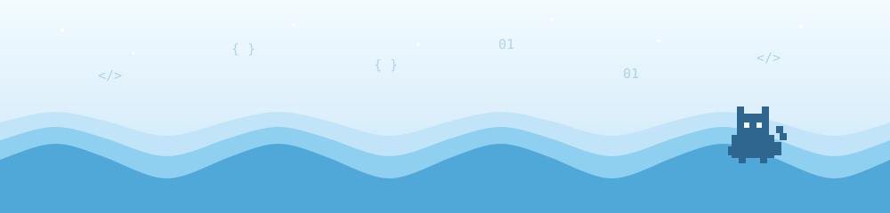

 ✦ Estudante de Informática • Desenvolvedora em formação ✦

  

Sou estudante do Curso Técnico Integrado em Informática no IFCE, com foco principal em Java e Programação Orientada a Objetos. Também estudo Python, desenvolvimento Front-end (HTML, CSS e JavaScript), lógica de programação e fundamentos de banco de dados.

Gosto de entender como as coisas funcionam por trás do código e estou construindo minha base técnica um projeto de cada vez — sempre em busca de aprender algo novo.

Linguagens

Ferramentas

Também em estudo

   banco de dados — conteúdo que faz parte da minha formação atual

<table>
<tr>
<td>☕ Java</td>
<td>🧩 Programação Orientada a Objetos</td>
<td>🌐 Front-end</td>
</tr>
<tr>
<td>🐍 Python</td>
<td>🗄️ Banco de Dados</td>
<td>🐧 Linux / Administração de Servidores</td>
</tr>
<tr>
<td colspan="3" align="center">🔌 Sistemas Embarcados</td>
</tr>
</table>

Em construção — em breve com os primeiros projetos.

<table>
<tr>
<td align="center" width="25%"><b>🌐 Projetos Web</b> em breve</td>
<td align="center" width="25%"><b>☕ Projetos Java</b> em breve</td>
<td align="center" width="25%"><b>🐍 Projetos Python</b> em breve</td>
<td align="center" width="25%"><b>🎓 Projetos Acadêmicos</b> em breve</td>
</tr>
</table>

 

 

✦ obrigada pela visita ✦
  

